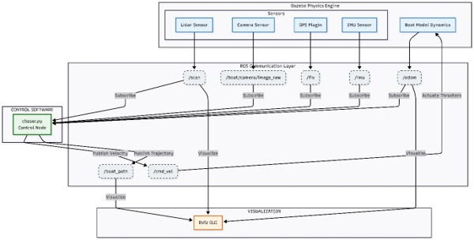
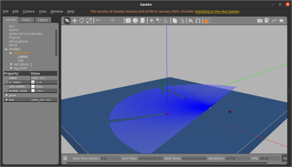
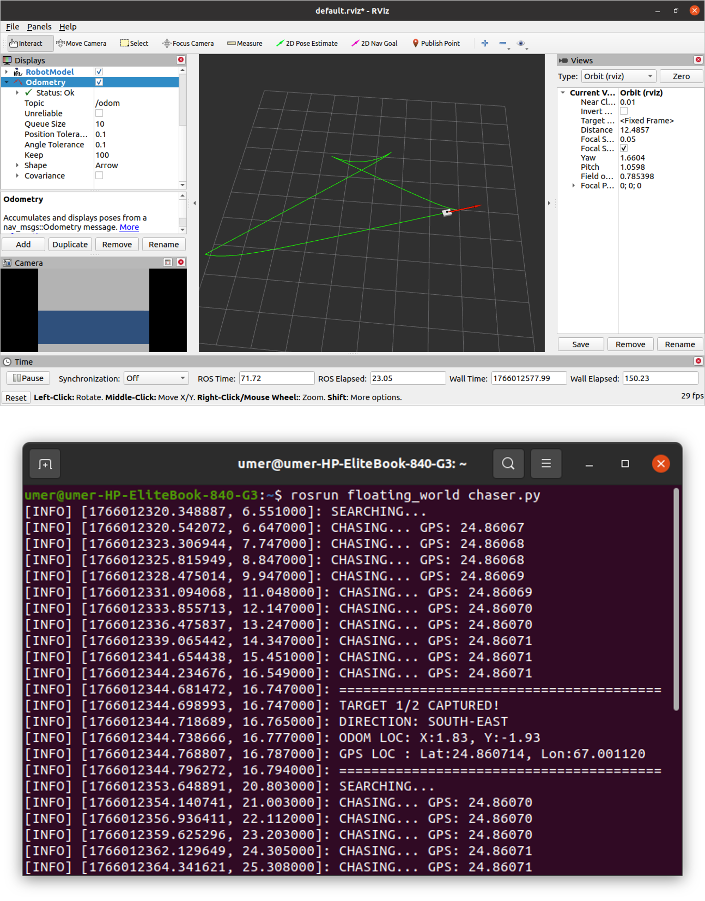

# Floating World — Autonomous Surface Surveillance Boat

A ROS-based simulation of an autonomous unmanned surface vehicle (USV) for maritime surveillance. The boat uses LiDAR, GPS, and a camera to detect targets, track their real-world coordinates, and navigate autonomously in a custom Gazebo ocean environment.

Built for the Robotic System and Programming course, Department of Electrical Engineering, Bahria University Karachi Campus (BS RIS-5, Fall 2025).

## Author

Muhammad Umer — 02-239232-023

Submitted to Sir Hamza.

## Overview

"Floating World" simulates a robot boat designed to safely test USV logic — GPS tracking, vision-based target detection, and autonomous navigation — without risking real hardware. The boat searches for a visual target, chases and captures it, logs its precise GPS location, then returns to its starting point.

The system combines:
- **ROS Noetic** — communication layer between all nodes and the simulated boat
- **Gazebo** — physics simulation of water, buoyancy, and boat dynamics
- **OpenCV** — HSV-based color detection to find red target blocks in the camera feed
- **Sensor fusion** — GPS and LiDAR combined for more precise target localization than GPS alone
- **RViz** — real-time visualization of the boat's path and sensor data

## How it works

The control logic runs as a Finite State Machine (FSM) with four stages:

1. **Search** — the boat rotates in place, scanning for a visual target using the camera.
2. **Chase** — once a red object is detected, the boat aligns toward it and closes in using a proportional (P) controller.
3. **Capture** — when LiDAR confirms the boat is close enough, it stops and calculates the target's GPS coordinates from its current heading and position.
4. **Return** — after capturing the target, the boat computes the vector back to its starting point and navigates home.

The boat itself is a URDF model (0.15 kg) using `planar_move` for movement and a custom buoyancy plugin for realistic floating behavior on the simulated water surface.

## System Architecture



## Repository structure

```
launch/
  sim.launch                  Launches Gazebo, the boat, and required ROS nodes

models/
  blue_block/                 Static obstacle/marker model
  flag/                       Target/waypoint marker model
  floating_block/              Target block model (with buoyancy)

nodes/
  chaser.py                   Main control node — FSM logic, vision, GPS/LiDAR fusion

src/
  plugins/
    buoyancy_plugin.cpp        Custom Gazebo plugin for water buoyancy physics

urdf/
  boat.urdf                    Boat robot description (links, joints, sensors)

worlds/
  water_world.world            Custom Gazebo world with water surface and targets

docs/
  floating_world_report.pdf    Full project report

media/
  gazebo.png                   Screenshot of the Gazebo simulation environment
  output.png                   RViz output showing path tracking and camera feed
  terminal_launch.png          Terminal output from roslaunch / rosrun
  working_architecture.jpg     System architecture diagram

CMakeLists.txt                 Catkin build configuration
package.xml                    ROS package manifest
```

## Requirements

- ROS Noetic
- Gazebo 11
- Python 2/3 with `rospy`
- OpenCV (`cv_bridge`, `opencv-python`)
- catkin workspace

## Getting started

1. Clone this repository into your catkin workspace's `src` folder:
   ```bash
   cd ~/catkin_ws/src
   git clone https://github.com/Umerkhalilkk/autonomous-surveillance-boat-in-ros.git
   ```
2. Build the workspace:
   ```bash
   cd ~/catkin_ws
   catkin_make
   source devel/setup.bash
   ```
3. Launch the simulation:
   ```bash
   roslaunch floating_world sim.launch
   ```
4. In a separate terminal, run the control node:
   ```bash
   rosrun floating_world chaser.py
   ```
5. Open RViz to visualize the boat's path and sensor data:
   ```bash
   rosrun rviz rviz
   ```

## Results

 

*Left: the boat in the Gazebo water world. Right: RViz showing live path tracking and camera feed.*

The simulation ran successfully, with the boat remaining stable on the water surface throughout operation. The vision system reliably detected the red target and transitioned the FSM from `SEARCHING` to `CHASING` immediately on detection. GPS values initialized at real-world Karachi coordinates (24.8607, 67.0011) and updated in real time with precision down to the 5th decimal place. Path tracking in RViz correctly reflected the boat's odometry throughout the run.

Full write-up, methodology, and discussion are documented in the project report: [`docs/floating_world_report.pdf`](docs/floating_world_report.pdf)

## Future work

A planned extension is attaching a robotic arm to the boat model, using simple inverse kinematics or predefined motions to physically grab a captured target — triggered only once the boat reaches it.

## References

- ROS Wiki. (2022). *gps_common - ROS Wiki*. http://wiki.ros.org/gps_common
- Gazebo Simulator. (2022). *Tutorial: Hydrodynamics*. http://gazebosim.org/tutorials
